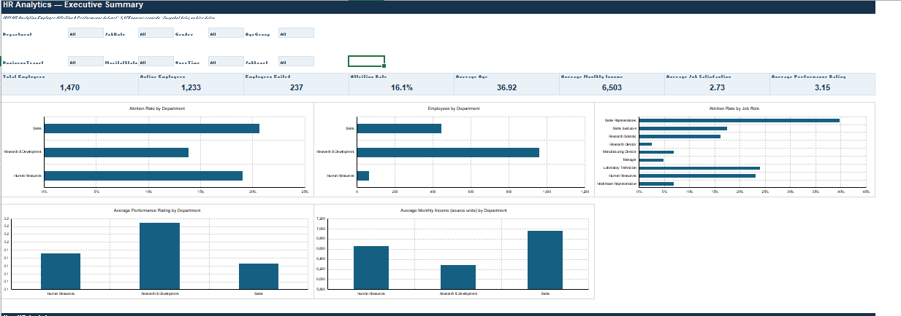
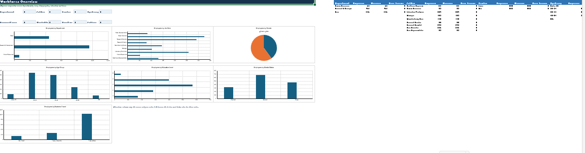
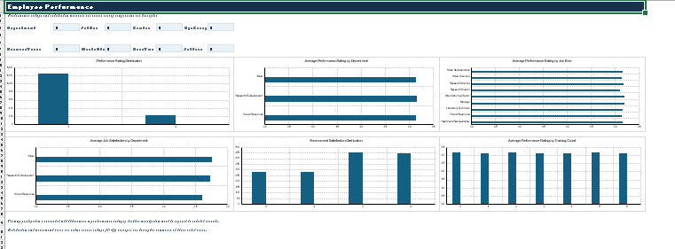
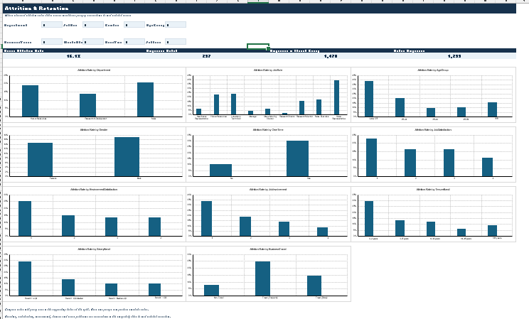
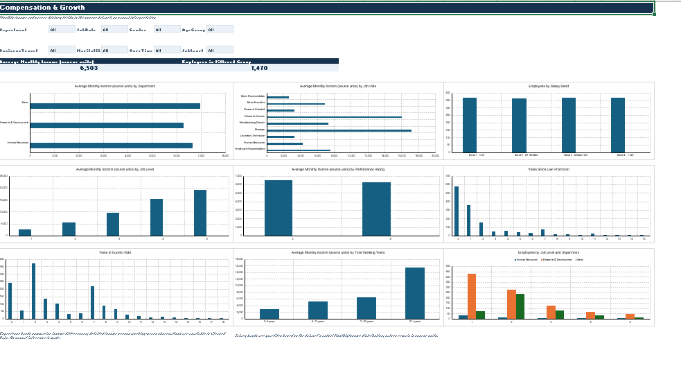

# HR Analytics Dashboard 📊

An end-to-end **HR Analytics Dashboard built in Microsoft Excel** using the IBM HR Analytics Employee Attrition & Performance dataset. The project turns employee-level HR data into interactive views for workforce composition, performance, attrition, compensation, and data quality.

## 🎯 Project Objective

The goal is to analyze workforce patterns and observed attrition using an interactive, portfolio-ready Excel dashboard. The dashboard is designed to help HR teams explore **where differences occur across employee groups** and identify areas that may need further investigation.

> **Note:** This dataset is a snapshot with 1,470 employee records and does not contain hire dates. The dashboard therefore focuses on descriptive workforce and attrition analysis rather than time-based hiring/turnover trends.

## 🛠️ Tools & Techniques

- Microsoft Excel
- Pivot Tables & Pivot Charts
- Excel Slicers / Interactive Filters
- Conditional Formatting
- Data Cleaning & Quality Checks
- KPI Cards
- Data Visualization
- HR Analytics
- Business Interpretation

## 📊 Dashboard Pages

The updated workbook contains six analytical views:

1. **HR Executive Summary** — high-level workforce KPIs, department attrition, performance and key HR insights.
2. **Workforce Overview** — employee composition across departments, job roles, demographics, education and business travel.
3. **Employee Performance** — performance ratings and employee satisfaction measures.
4. **Attrition & Retention** — observed attrition patterns across departments, roles and employee groups.
5. **Compensation & Growth** — monthly income and career-history measures such as years at company and years in current role.
6. **Data Quality** — source information and validation checks for the dataset.

The workbook also includes:

- **Cleaned Data** — prepared analysis-ready data.
- **Raw Data** — source dataset used for the project.

## 📌 Key Metrics & Analysis Areas

- Total employees
- Active employees
- Attrition rate
- Department-wise attrition
- Job-role analysis
- Gender and age-group analysis
- Business travel and overtime patterns
- Job satisfaction and work-life balance
- Performance ratings
- Monthly income
- Years at company and career progression
- Data-quality checks

## 🔎 Example Business Insights

The Executive Summary currently highlights:

- The workforce contains **1,470 employees**, with **1,233 active employees**.
- Research & Development represents **961 employees (65.4%)** of the workforce.
- In the current unfiltered department view, the observed attrition rate is **20.6% in Sales, 19.0% in Human Resources, and 13.8% in Research & Development**.

These are **descriptive observations from the dataset**, not evidence that a particular factor causes attrition.

## 🧹 Data Preparation

The project includes a dedicated **Data Quality** view and a **Cleaned Data** sheet. The workflow includes:

- Checking source row and field counts
- Standardizing data for analysis
- Reviewing data quality
- Preparing analysis-ready fields
- Separating raw source data from cleaned analysis data

## 🖼️ Dashboard Preview

### HR Executive Summary


### Workforce Overview


### Employee Performance


### Attrition & Retention


### Compensation & Growth


## 📁 Repository Structure

```text
HR-Analytics-Dashboard/
├── README.md
├── Dashboard/
│   └── IBM_HR_Analytics_Dashboard.xlsx
├── Dataset/
│   └── HR_Analytics_Dataset.csv
└── Screenshots/
    ├── HR-Executive-Summary.png
    ├── Workforce-Overview.png
    ├── Employee-Performance.png
💡 Portfolio Focus
This project demonstrates practical skills in:
- Excel dashboard development
- HR data analysis
- Data cleaning and validation
- KPI design
- Interactive reporting
- Data visualization
- Business-focused interpretation
👩‍💻 Author
Sindhuja Venugopal
BCA Graduate | Aspiring Data Analyst
Skills: Excel | SQL | Power BI | Prompt Engineering | AI Tools
    ├── Attrition-Retention.png
    └── Compensation-Growth.png
